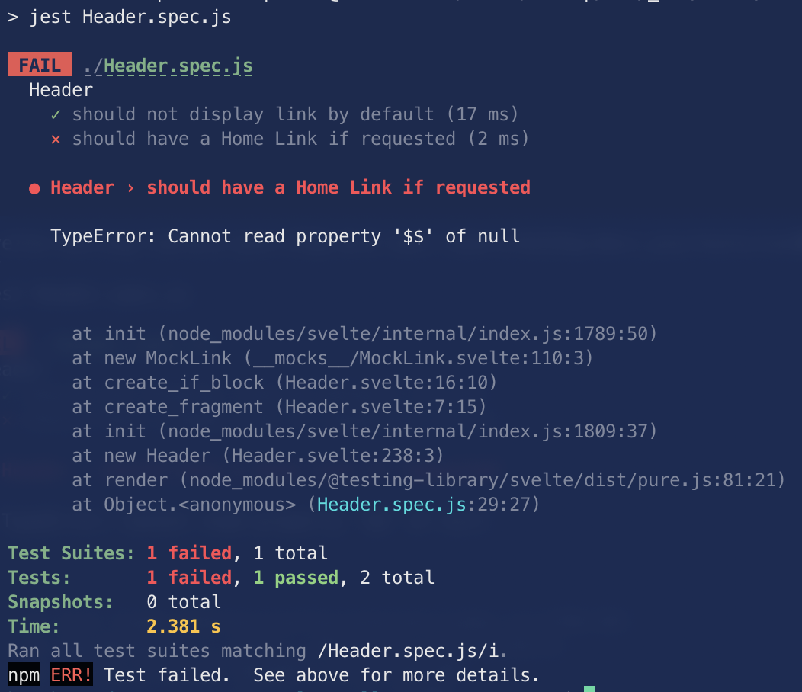
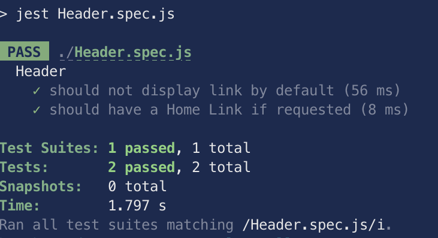

# svelte-testing-library test suite

Bug similar to what's decribed here: [https://github.com/sveltejs/svelte/issues/6584](https://github.com/sveltejs/svelte/issues/6584)

## Steps to reproduce the bug

Just launch:
```sh
npm ci 
npm test 
```

You should get:


## Steps to make sure it's OK with Svelte version 3.39.0

In `package.json`, replace:
```sh
    "svelte": "3.43.0",
```

by

```sh
    "svelte": "3.39.0",
```

and save.

Then run:

```sh
rm -Rf node_modules
npm install 
npm test 
```

You should get:

